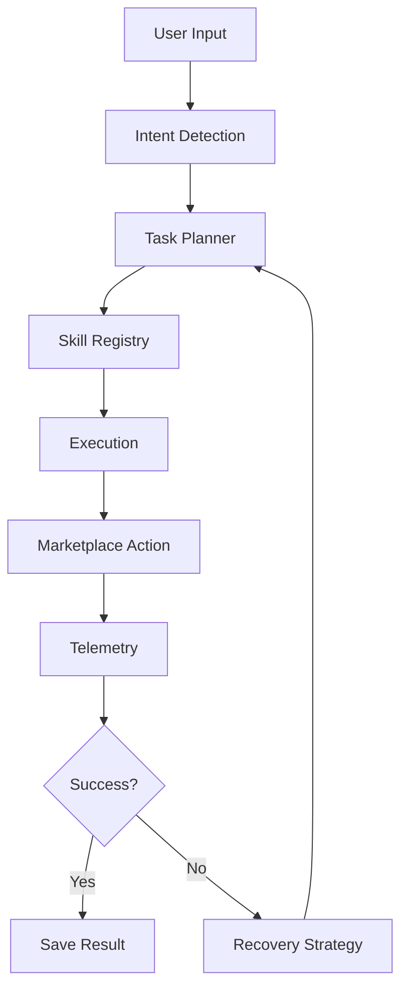

## Agent Workflow


# MarketMind AI


**MarketMind AI** is a Python automation core for marketplace operations: product monitoring, Ozon/Wildberries/Yandex Market parsing, Ozon card generation, table enrichment, task planning, skill-based workflows and telemetry-backed recovery for unstable scraping environments.

It should be presented as an AI-powered marketplace operations engine, not as a simple Telegram bot or a single-purpose parser.

```text
input -> intent -> planner -> skill registry -> execution -> telemetry -> recovery
```

## Core Capabilities

### Marketplace Intelligence

- Ozon parsing/search with Playwright and HTML/API extraction.
- Wildberries parsing through API/basket candidates and cloud fallback.
- Yandex Market parsing through HTML/JSON-LD extraction.
- Product monitoring, price history, alerts and exports.
- Scrape attempt telemetry, block memory and adaptive cooldown logic.

### Ozon Card Generation

- Ozon card drafts from free-form text or URLs.
- Competitor context for SEO and price orientation.
- Optional AI enhancement through the configured AI provider.
- YAML profiles for tone, required attributes and content restrictions.
- JSON/XLSX export for single and batch card workflows.

### Agent-Oriented Workflow

- Natural-language intent routing.
- `StructuredTask` normalization.
- `TaskPlan` generation through a skill registry.
- Skill manifests, dependency graph and execution state model.
- Agent loop: classify, choose strategy, execute, evaluate confidence, fallback and save experience.

### Operations Layer

- Telegram command interface and natural-language routing.
- CLI modes for updates, diagnostics, metrics, blocks and enrichment.
- Async SQLAlchemy storage.
- CSV, XLSX, JSON and HTML exports.
- Focused regression tests for parsers, planner, agent loop, cards, exports and Telegram helpers.

## Current State

| Layer | Status | Notes |
|---|---|---|
| Telegram bot, CLI, database, exports | Works | Operational entrypoints and tests exist |
| Ozon/WB/Yandex parsing | Works/usable | Real marketplace scraping depends on network and anti-bot conditions |
| Ozon card generation | Works/usable | Strongest commercial use case |
| Task intent and planner | Prototype/usable | Tested, but still needs product polish |
| Skill manifest graph and execution FSM | Prototype | Strong architecture foundation, not SaaS-ready by itself |
| Recovery/self-healing playbooks | Usable process | Engineering workflow, not magic auto-repair |
| SaaS/API/dashboard | Planned | Needs API, auth, billing, multi-user storage and UI |

## Repository Structure

```text
parser_agent/
  app/
    main.py                    # CLI entrypoint
    bot.py                     # Telegram commands and natural-language routing
    task_intents.py            # StructuredTask normalization
    task_planner.py            # TaskPlan and skill registry planning
    agent_loop.py              # Agent classify/strategy/execute/recover loop
    skill_manifest.py          # Skill graph and manifest support
    execution_state.py         # Execution lifecycle states
    database.py                # Async SQLAlchemy models and telemetry
    worker.py                  # Background add/update orchestration
    updater.py                 # Marketplace update pipeline and retries
    card_filler.py             # Ozon card draft, AI enhancement and exports
    card_profiles.py           # YAML profile loading
    exporter.py                # CSV/XLSX exports
    reporter.py                # HTML report generation
    parsers/                   # Ozon, Wildberries, Yandex Market, FunPay
    universal_parsing_core/    # Generic page classification/extraction
  docs/
    ARCHITECTURE_OVERVIEW.md
    DEMO_SCENARIOS.md
    BUYER_PITCH.md
    TECHNICAL_DUE_DILIGENCE.md
    diagrams/
  project_skills/
    SKILLPACK.md
    skills_index.json
    skills_database.md
    skill_manifests/
  profiles/
  tests/
```

## Architecture

MarketMind AI is packaged around an architecture-first story: user input becomes structured intent, the planner selects skills, execution produces marketplace/card/export results, and telemetry feeds recovery decisions.

Full architecture map:

- [Architecture Overview](docs/ARCHITECTURE_OVERVIEW.md)

Mermaid diagrams:

- [Agent workflow](docs/diagrams/agent_workflow.mmd) - input, intent, planner, skills, execution and telemetry loop.
- [Skillpack lifecycle](docs/diagrams/skillpack_lifecycle.mmd) - how local skills are selected, applied, verified and updated.
- [Recovery loop](docs/diagrams/recovery_loop.mmd) - failure handling, fallback decisions and regression-first repair.
- [Marketplace layer](docs/diagrams/marketplace_layer.mmd) - router, marketplace parsers, normalization, exports and resilience.

Commercial packaging docs:

- [Demo Scenarios](docs/DEMO_SCENARIOS.md)
- [Buyer Pitch](docs/BUYER_PITCH.md)
- [Technical Due Diligence](docs/TECHNICAL_DUE_DILIGENCE.md)

## Quick Start

### 1. Configure

```bash
cp .env.example .env
notepad .env
```

Minimum required values:

```text
BOT_TOKEN=<telegram bot token>
ADMIN_IDS=<your telegram id>
```

AI features are optional and depend on the configured provider.

### 2. Install

```bash
py -3.11 -m pip install -r requirements.txt
py -3.11 -m playwright install chromium
```

### 3. Run

```bash
# Telegram interface
py -3.11 -m app.main --telegram

# Update tracked products
py -3.11 -m app.main --update

# Recent scrape attempts
py -3.11 -m app.main --metrics 20

# Anti-bot/block memory diagnostics
py -3.11 -m app.main --blocks 20

# Enrich XLSX/CSV table
py -3.11 -m app.main --enrich input.xlsx --out output.xlsx --limit 50
```

### 4. Test

```bash
.\.venv\Scripts\python.exe -m unittest discover -s tests -v
```

Local tests are designed to avoid real Telegram polling, live marketplace credentials and production tokens. Live marketplace smoke checks should be opt-in and run only against safe targets.

## Main Telegram Workflows

| Command | Purpose |
|---|---|
| `/add` | Add Ozon/WB/Yandex/FunPay URLs to monitoring |
| `/update` | Update tracked prices |
| `/metrics` | Show recent scrape attempts |
| `/blocks` | Show anti-bot and block memory diagnostics |
| `/search` | Search products |
| `/compare` | Compare prices |
| `/ozon_card` | Generate one Ozon card |
| `/ozon_batch_cards` | Generate a batch of Ozon cards |
| `/profile` | Select card generation profile |
| `/export_csv` / `/export_excel` | Export data |
| `/report` | Generate HTML report |

## What This Project Is Not

- Not just a WB/Ozon parser.
- Not just a Telegram bot.
- Not a finished SaaS product.
- Not a fully autonomous self-healing AI platform.
- Not a replacement for marketplace Seller API validation.

## Positioning

Use this:

> MarketMind AI is a working marketplace automation core with Ozon card generation, marketplace parsers, exports, telemetry and an agent-oriented skill/planner architecture.

Avoid this:

> A simple Telegram parser bot.

## Production Roadmap

- FastAPI/API layer.
- Multi-user auth and roles.
- Postgres + migrations.
- Queue/scheduler for batch jobs.
- Dashboard for jobs, attempts, blocks and exports.
- Seller API validation for Ozon cards.
- Safe live smoke checks and demo datasets.
- Deployment packaging and product documentation.
