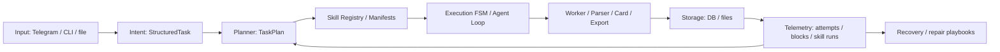

# MarketMind AI Architecture Overview

MarketMind AI is built as a marketplace automation pipeline, not as a single parser script. Telegram and CLI are interfaces; the main architecture runs through intent normalization, planning, skill selection, execution and telemetry-backed recovery.

## High-Level Flow



## Runtime Entrypoints

| Entrypoint | Role |
|---|---|
| `app/main.py` | CLI modes: Telegram, update, metrics, blocks, enrichment |
| `app/bot.py` | Telegram commands and natural-language routing |
| `START_AGENT.bat` | Local operator launcher |
| `cloud_wb_function.py` | Wildberries cloud fallback |

## Intent and Planning Layer

| Component | Files | Status |
|---|---|---|
| Natural-language intent router | `app/task_intents.py`, `app/bot.py` | Prototype/usable |
| Task planner | `app/task_planner.py` | Prototype |
| Agent loop | `app/agent_loop.py` | Prototype/usable |
| Execution state | `app/execution_state.py` | Prototype |

This layer turns vague user input into explicit work:

```text
free text -> StructuredTask -> TaskPlan -> ordered steps -> executable/missing skills
```

Buyer-safe message: MarketMind AI already has the skeleton of an agent workflow, but it is honestly still a product core, not a finished SaaS.

## Skillpack and Skill Manifests

| Component | Files | Purpose |
|---|---|---|
| Project skillpack | `project_skills/` | Engineering memory and reusable recipes |
| Skill index | `project_skills/skills_index.json` | Machine-readable skill catalog |
| Skill database | `project_skills/skills_database.md` | Human-readable implementation recipes |
| Skill manifests | `project_skills/skill_manifests/*.yaml` | Runtime skill graph definitions |
| Skill graph code | `app/skill_manifest.py` | Dependencies, fallbacks, graph rendering |
| Skill telemetry | `app/skill_telemetry.py` | Runtime measurement hooks |

Commercial value: this is the part that separates MarketMind AI from a normal parser. It gives a path to grow new capabilities as skills instead of one-off handlers.

## Marketplace Layer

| Marketplace | Files | Approach |
|---|---|---|
| Ozon | `app/parsers/ozon.py`, `app/updater.py`, `app/searcher.py` | Playwright/browser + HTML/API extraction |
| Wildberries | `app/parsers/wildberries.py`, `cloud_wb_function.py` | API/basket candidates + cloud fallback |
| Yandex Market | `app/parsers/yandex_market.py` | HTML/JSON-LD extraction |
| Generic pages | `app/generic_scraper.py`, `app/universal_parsing_core/` | Page classification and universal extraction |

Parser contract: marketplace parsers should return normalized `ProductData`; routing stays centralized in `app/parsers/router.py`.

## Card Generation Layer

| Component | Files | Output |
|---|---|---|
| Local Ozon draft | `app/card_filler.py` | `OzonCardDraft` |
| AI enhancement | `app/card_filler.py`, `app/ai_client.py` | improved title, description, attributes, notes |
| Competitor context | `app/card_research.py`, `app/searcher.py` | SEO and pricing context |
| Profiles | `app/card_profiles.py`, `profiles/*.yaml` | style and validation rules |
| Exports | `app/card_filler.py`, `app/exporter.py` | JSON/XLSX |

This is the strongest business demo because sellers and agencies immediately understand the value: less manual work for marketplace card preparation.

## Resilience and Telemetry

| Signal | Files | Why it matters |
|---|---|---|
| Scrape attempts | `app/database.py`, `app/updater.py` | source, status, HTTP status, latency, error |
| Block memory | `app/database.py`, `app/worker.py` | anti-bot and network failure history |
| Adaptive strategy | `app/resilience.py`, `app/updater.py` | cooldowns, skips, source strategy |
| Repair workflow | `docs/SELF_HEALING_PLAYBOOK.md` | regression-first fix process |
| Parser craft rules | `docs/PARSING_CRAFT_PLAYBOOK.md` | structured sources, fallbacks, tests |

This should be sold as "measured recovery workflow", not as magical self-healing.

## Export and Reporting Layer

| Output | Files |
|---|---|
| CSV | `app/exporter.py` |
| XLSX | `app/exporter.py`, `app/card_filler.py` |
| HTML report | `app/reporter.py`, `templates/report_template.html` |
| JSON cards | `app/card_filler.py` |
| Batch enrichment | `app/batch_enricher.py`, `app/brd_enricher.py` |

## Diagram Links

- [Agent workflow](diagrams/agent_workflow.mmd)
- [Skillpack lifecycle](diagrams/skillpack_lifecycle.mmd)
- [Recovery loop](diagrams/recovery_loop.mmd)
- [Marketplace layer](diagrams/marketplace_layer.mmd)

## Test Coverage Map

Representative tests:

| Area | Tests |
|---|---|
| Agent loop | `tests/test_agent_loop.py` |
| Intent/planner | `tests/test_task_intents.py`, `tests/test_task_planner.py` |
| Skill manifests | `tests/test_skill_manifest.py`, `tests/test_skill_telemetry.py`, `tests/test_execution_state.py` |
| Cards | `tests/test_card_filler.py`, `tests/test_card_profiles.py`, `tests/test_card_research.py` |
| Parsers | `tests/test_parsers.py`, `tests/test_funpay_parser.py`, `tests/test_parser_universal.py` |
| Exports | `tests/test_exports.py`, `tests/test_telegram_exports.py` |
| CLI/worker/database | `tests/test_cli.py`, `tests/test_worker.py`, `tests/test_database.py` |

## Buyer-Safe Architecture Claim

Use this wording:

> MarketMind AI is a working Python marketplace automation core with an agent-oriented architecture: intent routing, planning, skill manifests, marketplace parsers, Ozon card generation, exports, telemetry and recovery playbooks.

Avoid this wording:

> Fully autonomous self-healing AI platform.

That second phrase invites expectations the codebase is not yet packaged to meet.
