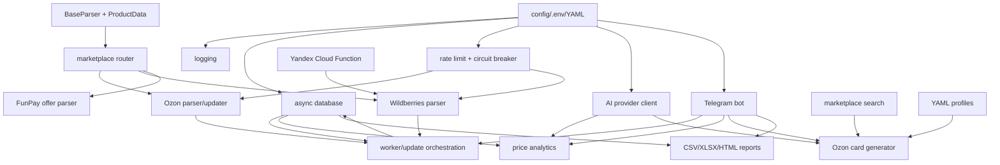

# База скиллов проекта D:\LLM

Дата анализа: 2026-05-17.

Эта папка содержит не документацию конкретного приложения, а базу повторяемых инженерных рецептов, извлеченных из проектов в `D:\LLM`.

## Что проанализировано

- `parser_agent` - самый зрелый проект: Telegram-бот для мониторинга маркетплейсов, парсеры Ozon/Wildberries/FunPay, async SQLAlchemy, AI-анализ, отчеты, экспорт, YAML-профили, Yandex Cloud Function.
- `parser_tg` и `parser_v2` - ранние/параллельные версии того же семейства: Ozon/WB updater, aiogram-бот, Docker/config.yaml, cloud function.
- `2026-04-23-new-chat` - FastAPI/Telegram LLM-agent, API key middleware, rate limit, SQLite memory, sandbox, static UI, тесты.
- `agent3_5` - прототип агентного пайплайна: planner/critic, web-search fallback, self-healing code loop, memory storage.
- `autonomous-researcher-main` - автономный исследователь: CLI/API orchestration, subprocess streaming, Rich logging, sandbox experiment loop, provider abstraction.
- `tg_bot.py`, `build_parser_project.py` - самостоятельные скрипты Telegram-парсера и генерации структуры проекта.
- `goose-main`, `UI-TARS-desktop-main`, `dist-windows`, `lmstudio-community`, архивы и virtualenv - отмечены как внешние/бинарные/вендорные области; их внутренний код не смешан с базой скиллов пользовательского Python-проекта.

## Файлы базы

- `skills_database.md` - основная база скиллов с архитектурой, категориями, картой зависимостей, стилем проекта и подробными карточками.
- `architecture_review.md` - слабые места архитектуры, missing skills, reusable skills и roadmap.
- `skills_index.json` - машиночитаемый индекс: ID, категория, сложность, maturity, priority, зависимости и обратные зависимости.
- `missing_skills_prioritized.yaml` - приоритизированный backlog недостающих reusable skills.
- `SKILLPACK.md` - главный входной файл для любой нейронки или агента.
- `skillpack.json` - manifest пакета скиллов.
- `.skillscheck` - marker-файл: если он есть, skillpack считается активным.
- `SKILL_TRIGGERS.md` - keyword-trigger, `@skills:` комментарии и `pyproject.toml` marker.
- `SESSION_UPDATE_PROTOCOL.md` - обязательный протокол пополнения базы после каждой сессии.
- `session_update_template.yaml` - шаблон pending proposal.
- `session_updates/` - inbox для предложений, которые еще не внесены в основную базу.
- `INSTRUCTION_CHEATSHEET.md` - шпаргалка по выбору instruction-файла.
- `install_snippets/` - готовые шаблоны для Codex/OpenAI agents, Claude Code, Cursor, Copilot и Windsurf.

## Как искать по базе

Примеры запросов к `skills_index.json`:

```powershell
# Все senior skills
Get-Content .\project_skills\skills_index.json | ConvertFrom-Json |
  Select-Object -ExpandProperty skills |
  Where-Object complexity -eq "senior"

# Все, кто зависит от ai-provider-router
Get-Content .\project_skills\skills_index.json | ConvertFrom-Json |
  Select-Object -ExpandProperty skills |
  Where-Object { $_.dependencies -contains "ai-provider-router" }

# Impact analysis: кто сломается при изменении database-async-sqlalchemy
Get-Content .\project_skills\skills_index.json | ConvertFrom-Json |
  Select-Object -ExpandProperty skills |
  Where-Object id -eq "database-async-sqlalchemy" |
  Select-Object -ExpandProperty dependents
```

## Проверка drift

Чтобы Markdown и JSON не разъехались при добавлении новых скиллов, запускайте валидатор:

```powershell
python .\project_skills\validate_skills.py
```

Он проверяет:

- все ID из `skills_database.md` есть в `skills_index.json` и наоборот;
- нет дублей ID;
- в JSON заполнены обязательные поля;
- `complexity`, `maturity`, `priority` имеют допустимые значения;
- зависимости указывают на существующие скиллы;
- обратные зависимости согласованы с прямыми.

## Пополнение после сессии

В конце каждой сессии агент должен прочитать:

```text
project_skills/SESSION_UPDATE_PROTOCOL.md
```

И выполнить один из вариантов:

- обновить существующий skill;
- добавить новый skill;
- создать proposal в `project_skills/session_updates/`;
- явно сказать, что новых reusable skills не появилось.

## Основная архитектура

Проекты вокруг `parser_agent` используют слоистую архитектуру:

1. Входы: Telegram bot (`app/bot.py`), CLI (`app/main.py`), cloud function (`cloud_wb_function.py`), FastAPI (`2026-04-23-new-chat/api`).
2. Оркестрация: `worker.py`, bot handlers, natural-language dispatch, batch workflows.
3. Доменные сервисы: marketplace parsers, updater, searcher, AI analyzer, card generator.
4. Инфраструктура: config, logging, async DB, filesystem exports, debug dumps, metrics.
5. Данные: SQLAlchemy models, price history, subscribers, scrape attempts, JSONL telemetry, YAML profiles.
6. Выходы: Telegram messages/files, CSV/XLSX, HTML report, JSON payloads, API responses.

## Основные категории скиллов

- `config` - `.env`, YAML, обязательные переменные, proxy normalization.
- `logging` - RotatingFileHandler, Rich console, scrape attempts telemetry.
- `database` - async SQLAlchemy, migrations, history tables, subscribers.
- `telegram` - aiogram commands, FSM, access control, file sending, broadcast.
- `parser` - parser contract, marketplace router, Ozon/WB/FunPay parsing.
- `selenium/playwright` - browser lifecycle, stealth, scroll/mouse behavior, screenshots/debug.
- `resilience` - retries, rate limit, circuit breaker, fallback, anti-block statuses.
- `api` - FastAPI middleware, API key auth, request rate limit, streaming subprocess.
- `ai` - provider abstraction, prompt contracts, JSON extraction, analytics, self-heal.
- `export` - CSV, Excel, HTML reports, Ozon card JSON/XLSX.
- `filesystem` - debug dumps, generated files, safe temp files, JSONL.
- `deploy` - Docker, run scripts, Yandex Cloud Function packaging.

## Карта зависимостей



## Стиль разработки проекта

- Практичный прототипный стиль: много рабочих сценариев собрано быстро, с постепенным усилением устойчивости.
- Сильная async-ориентация: aiogram, aiohttp, Playwright async API, SQLAlchemy async sessions.
- Модульность присутствует в `parser_agent`: `parsers`, `adapters`, `core`, `utils`, `database`, `exporter`, `reporter`.
- Naming в основном предметный: `worker_add_urls`, `fetch_product_auto`, `record_scrape_attempt`, `build_ozon_card_draft`.
- Ошибки часто превращаются в статусы и fallback-результаты, а не пробрасываются наверх.
- Логирование и диагностика развиты, но не полностью унифицированы между проектами.
- Есть смешение зрелого кода и экспериментальных прототипов, из-за чего часть паттернов дублируется.
